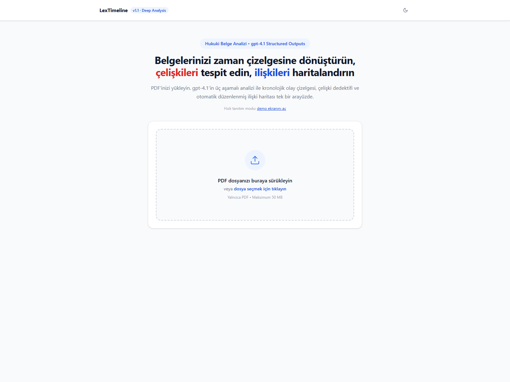
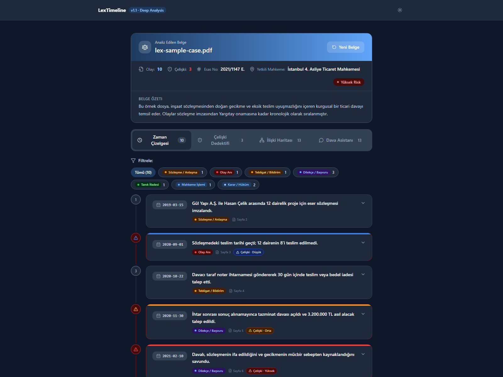
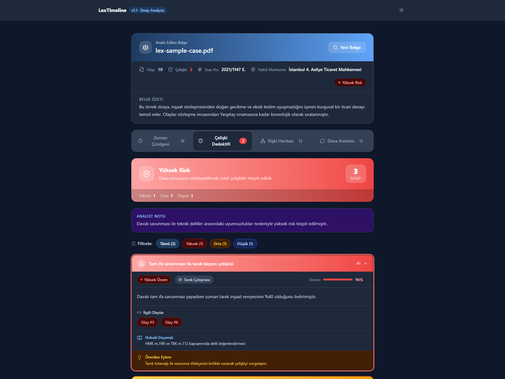
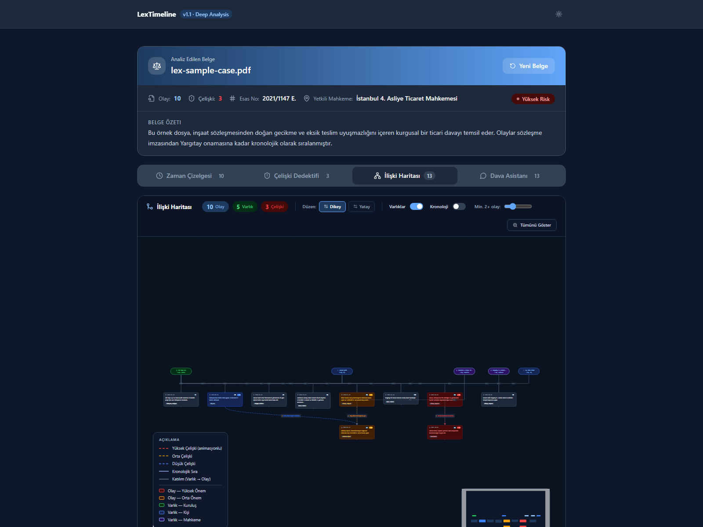
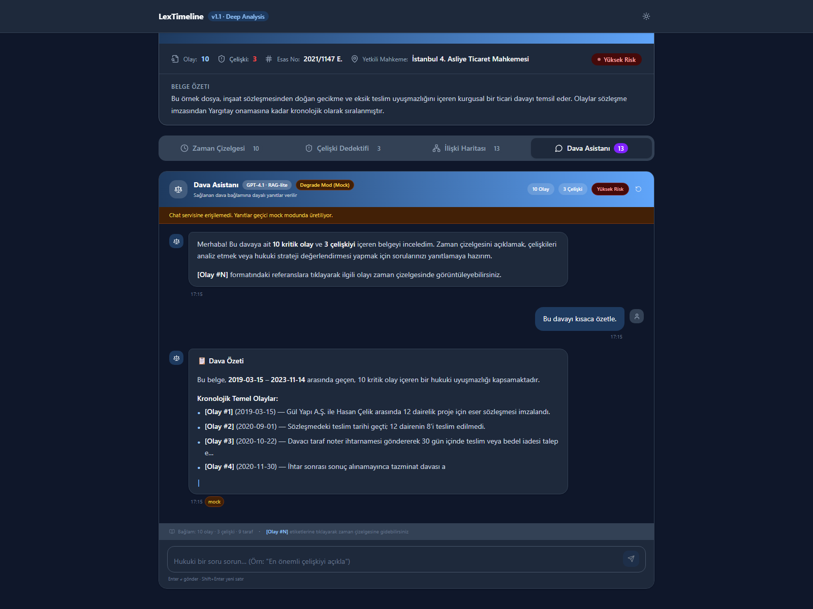

<p align="center">
  
</p>

<p align="center">
  <b>AI-powered legal timeline intelligence for Turkish case files.</b><br/>
  Extract chronology, detect contradictions, explore relationship graphs, and interrogate your case with chat.
</p>

<p align="center">
  <a href="https://github.com/onatozmenn/LexTimeLine/stargazers"></a>
  <a href="https://github.com/onatozmenn/LexTimeLine/network/members"></a>
  <a href="LICENSE"></a>
  
  
</p>

<p align="center">
  If this project is useful, please <b>star the repo</b> to support development.
</p>

---

## Why LexTimeline?

Legal files are long, repetitive, and full of temporal dependency.
LexTimeline gives you a litigation-oriented cockpit:

- Timeline-first analysis with source pages and event-level significance
- Automatic contradiction detection with severity, confidence, legal basis, and suggested action
- Interactive relationship graph (event/event contradiction links + entities)
- Built-in legal chat assistant with citation jumps (`[Olay #N]`)
- Dark-mode polished UI with semantic design tokens

---

## Product Gallery

### 1) Upload & Analyze


### 2) Timeline View


### 3) Contradiction Detective


### 4) Relationship Graph


### 5) Case Chat (with transparent degrade mode fallback)


> Screenshots are generated from the included demo dataset and sample PDF in this repository.

---

## Quick Start

### Prerequisites

- Node.js 18+
- Python 3.11+
- Azure OpenAI credentials (for full backend AI flow)

### Install

```bash
git clone https://github.com/onatozmenn/LexTimeLine.git
cd LexTimeLine

npm install
pip install -r requirements.txt
```

### Environment

Create `.env` in project root:

```env
AZURE_OPENAI_ENDPOINT=https://<your-resource>.openai.azure.com/
AZURE_OPENAI_API_KEY=<your-api-key>
AZURE_OPENAI_DEPLOYMENT_NAME=gpt-4.1
AZURE_OPENAI_CHAT_DEPLOYMENT_NAME=gpt-4.1
AZURE_OPENAI_API_VERSION=2024-12-01-preview
```

### Run

Terminal 1:

```bash
uvicorn main:app --reload --host 0.0.0.0 --port 8000
```

Terminal 2:

```bash
npm run dev
```

Open:

- Frontend: `http://localhost:5173`
- API Docs: `http://localhost:8000/docs`

---

## Sample PDF Included

Use this file to test the upload flow immediately:

- [`docs/samples/lex-sample-case.pdf`](docs/samples/lex-sample-case.pdf)

Regenerate it:

```bash
npm run sample:pdf
```

---

## Demo Mode (No Backend Needed for UI Preview)

For instant UI exploration (timeline, contradictions, graph, chat):

`http://localhost:5173/?demo=1`

This mode loads a bundled analysis object and is intended for UI demos, docs, and screenshots.

---

## Architecture

```text
React (Vite + TS + Tailwind)
  -> POST /analyze/deep
FastAPI
  -> PDF parse (PyMuPDF)
  -> LLM extraction (gpt-4.1)
  -> Logic analyzer (gpt-4.1)
  -> AnalysisResult
React UI
  -> Timeline + Contradictions + Graph + Chat
```

### Backend Pipeline

1. PDF text extraction (`services/pdf_parser.py`)
2. Structured event extraction (`services/llm_extractor.py`)
3. Contradiction analysis (`services/logic_analyzer.py`)
4. Chat reasoning endpoint (`backend/services/chat_service.py`)

### Frontend UX Layer

- Semantic tokenized theme (`src/styles/theme.css`)
- Timeline cards + category badges + contradiction chips
- XYFlow-based graph board with responsive canvas and dark-theme palette
- Chat fallback transparency (`server` vs `mock` source state)

---

## API Reference

| Method | Endpoint | Purpose |
|---|---|---|
| `POST` | `/analyze` | Fast timeline extraction |
| `POST` | `/analyze/deep` | Timeline + contradiction intelligence |
| `POST` | `/chat` | Case Q&A grounded on `AnalysisResult` |

### `/chat` contract

Request:

```json
{
  "query": "Bu davayı özetle",
  "context": { "...": "AnalysisResult" },
  "model": "gpt-4.1"
}
```

Response:

```json
{
  "answer": "...",
  "model_used": "gpt-4.1"
}
```

---

## Developer Scripts

```bash
npm run dev                 # frontend dev server
npm run build               # production frontend build
npm run sample:pdf          # regenerate sample PDF
npm run screenshots:readme  # regenerate README screenshots
python -m pytest -q         # backend tests
```

---

## Deployment

- Dockerfile included (`Dockerfile`)
- Fly.io config included (`fly.toml`)
- Render config included (`render.yaml`)

---

## Repository Layout

```text
main.py
models.py
services/
backend/
src/
docs/
  assets/
  screenshots/
  samples/
scripts/
```

---

## Contributing

Issues and PRs are welcome.

Good first contribution ideas:

1. Add test coverage for parser/analyzer edge cases
2. Improve graph clustering/layout for dense case files
3. Add multi-document case workspace support
4. Add benchmark suite for extraction quality and latency

---

## License

This project is licensed under the MIT License.

- Full text: [`LICENSE`](LICENSE)
- Third-party attributions: [`ATTRIBUTIONS.md`](ATTRIBUTIONS.md)

---

<p align="center">
  Built for legal practitioners who need speed, structure, and explainability.<br/>
  <b>Star LexTimeline if you want to see this evolve.</b>
</p>

